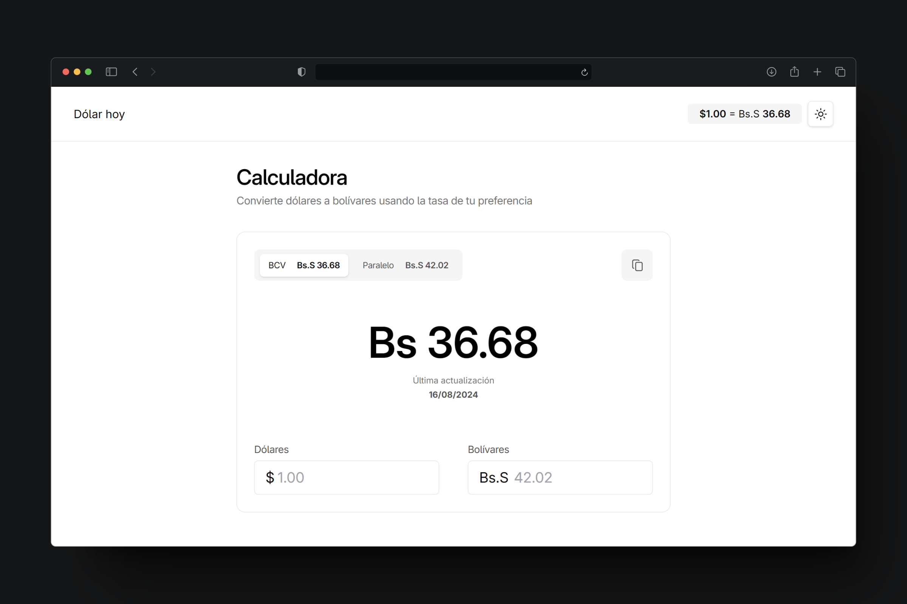

# Dólar hoy

Dólar hoy es una aplicación / calculadora creada para facilitar las conversiones monetarias en Venezuela.

La idea de la aplicación fue crear una calculadora sencilla pero al mismo tiempo bonita y que permita las conversiones de forma rápida en las dos principales tasas de dólar del país: BCV y Paralelo

Esta aplicación utiliza la API creada por el usuario *fcoagz*: [Link del repositorio de la API](https://github.com/fcoagz/api-pydolarvenezuela).



## 🚀 Estructura del proyecto

El proyecto está desarrollado utilizando Astro, React y Talwind CSS para estilar los componentes de forma sencilla. La estructura del proyecto es la siguiente:

```text
/
├── public/
│   └── favicon.svg
├── src/
│   ├── components/
│   │   └── header
│   │   └── mainContainer
│   │   └── title
│   ├── layouts/
│   │   └── Layout.astro
│   └── pages/
│       └── index.astro
└── package.json
```

